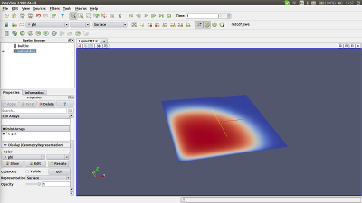

# A Mini App for Teaching Basic HPC

This is a simple application that solves a simple reaction diffusion equation in 2D, which uses some common computational kernels that can be used to teach basic HPC programming methods.

The equation is Fisher's equation, a simple nonlinear reaction diffusion equation that is used to model simple population dynamics.

```
  2      2                
 d u    d u               
---- = D---  +  Ru(1 - u) 
   2      2               
d t     dx      
```

Where the diffusion parameter _D_ and the growth rate _R_ have been hard coded in this case to give stable and interesting results.

####begin numerics mumbo-jumbo for those who are interested
The spatial discretization is simple finite differences, with a 5-point Laplacian for the spatial derivative (the spatial discretization has constant grid spacing which makes the 5-point Laplacian second order). An implicit temporal discretization is employed, which requires the solution of a non-linear system of equations at each time step. Newton-Raphson iteration is used to solve the nonlinear system, with conjugate gradient (CG) method used to solve the linear systems.

The conjugate gradient method does not directly use the Jacobian matrix, instead it computes the matrix-vector product with the Jacobian. It is not necessary to compute the Jacobian, because this product may be approximated using a finite difference approximation that requires the computation of the stencil operator.
####end numerics mumbo-jumbo

The implicit time stepping scheme and matrix-free conjugate gradient method were chosen because they use more simple kernels that can be used as parallelization examples than simple explicit time stepping. A set of level-1 BLAS routines are required, including saxpy (simple for_all parallel) and dot product (a parallel reduction operation), as well as the stencil operator. A simple boundary echange must be performed before the stencil operatior is applied to nodes on the boundary of a sub domain.

### How to build

Each of the components (serial, OpenMP, etc...) is designed to be self-contained. Building a component on a Cray system should be as simple as (assuming that either the GNU or Cray programming environment is loaded):

```
$ cd <component>
$ make
```

Build notes specific to individual components is given below where relevant

#### OpenMP component

The OpenMP Fortran component has been tested with both Cray and GNU compilers on XK7, XC30 systems. The makefil detects which programming environment is loaded, and choose appropriate flags for OpenMP (so long as either Cray or GNU environments are present).

### How to run

The application takes up to 5 parameters:

```
main nx ny nt tend verbose
```

- nx is the x dimension of the computational domain.
- ny is the y dimension of the computational domain
- nt is the number of time steps
- tend is the total length of time for the simulation
- verbose (optional) if a fifth argument is passed, verbose output will be generated. This includes information about the domain decomposition, and conjugate gradient convergence statistics at each time step.

The domain has a width of 1, reguardless of the input dimensions, so the horizontal grid spacing is _h=1/(nx+1)_. The grid spacing is the same on the x and y axis, so if a rectangular domain is chosen with _ny .ne. nx_, the vertical dimension of the domain will be _ydim=h*(ny+1)_.

The grid dimensions are important when choosing a set of parameters for running the test, because the maximum possible time step size for which the iterations will converge is dependent on the size of _h_. As the grid spacing _h_ decreases, the size of the time step also has to decrease (that is, the number of time steps has to increase). A good time scale to see something interesting happen is 0.01 seconds, so the following set of parameters are a good spot to start:
```
$ OMP_NUM_THREADS=8 aprun -cc none ./main 128 128 100 0.01
```

## Visualising the results

The application outputs the final solution in the "brick of values" format, which is stored in the two files __output.bin__ and __output.bov__. These can be viewed using the popular visualization packages Paraview and Visit. An example output in Paraview is



The visualization isn't just a pretty picture, it is very useful for debugging the code. A quick visual check can show if there are any problems with the boundary conditions, or halo exchanges for the MPI implementation. For this reason, the MPI implementations use MPI IO to output the global solution, and it is highly recommended that this feature should be used to help students implement halo exchanges.
